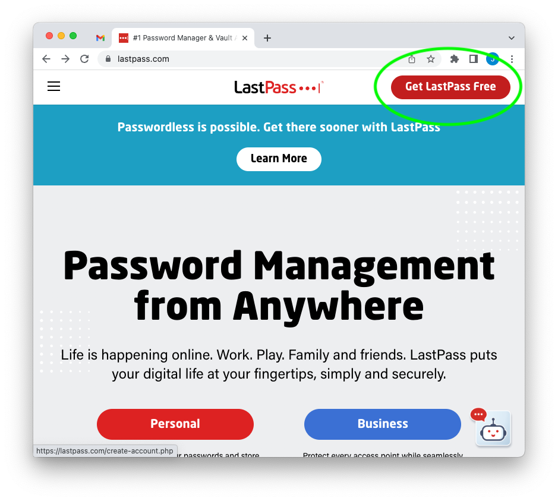
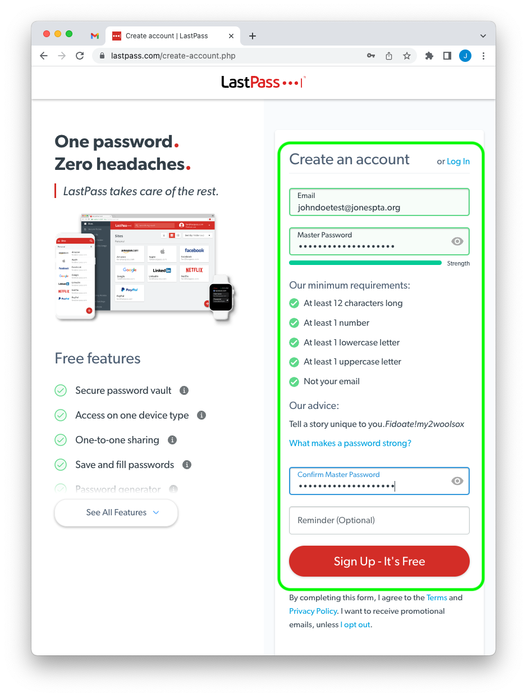
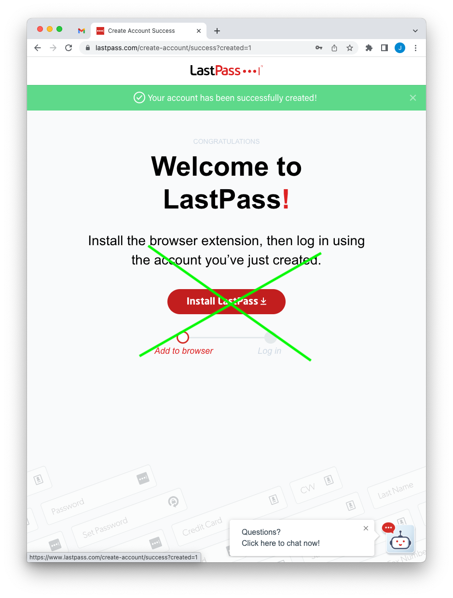
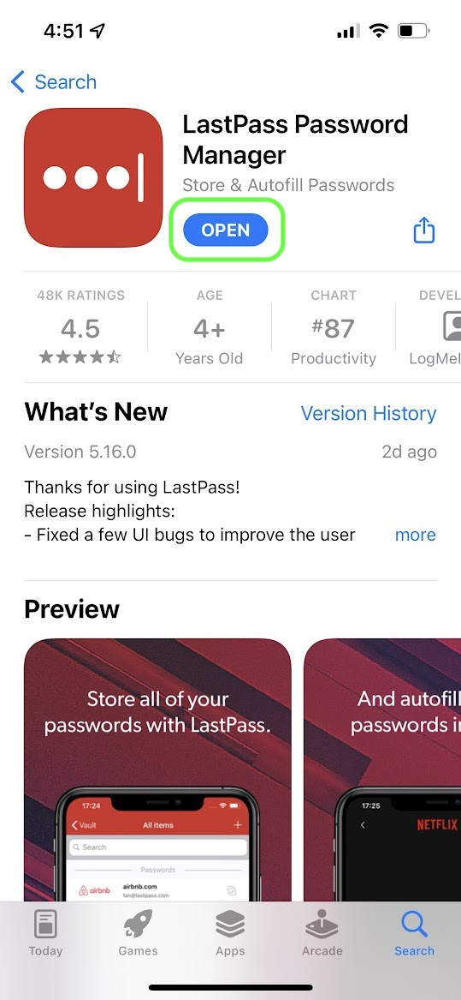
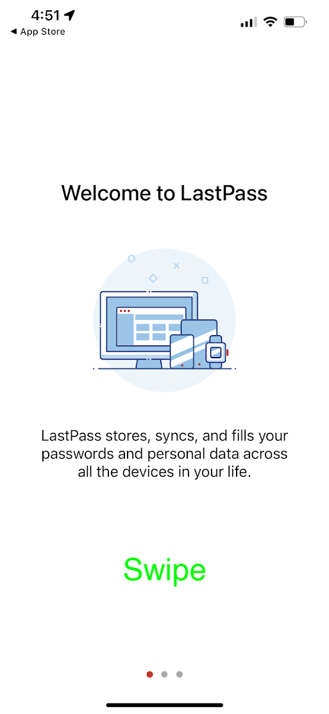
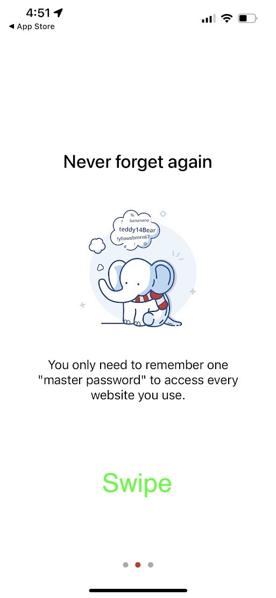
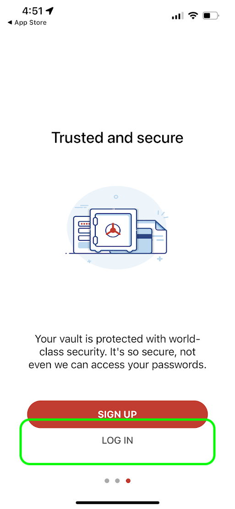
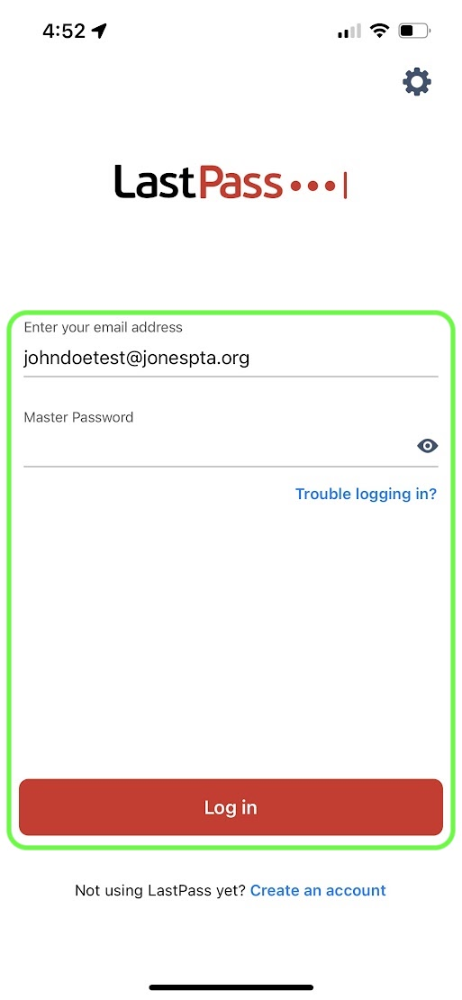
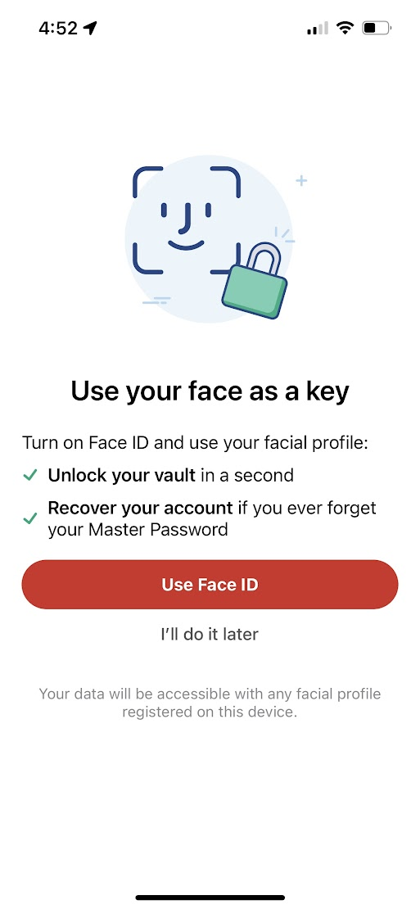
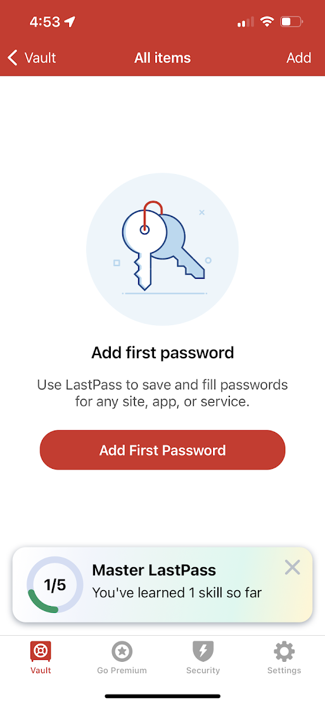

# Sign Up for LastPass
These instructions will help you sign up for LastPass as a free user.  If you already have a LastPass account, you can skip these steps and move on to [viewing a password that has been shared with you](./lastpass-view.md).

## Go to the LastPass Website
Go to [https://lastpass.com](https://lastpass.com) and click on the "Get LastPass Free" button.

## Enter Your Information
Enter your username and password into the signup form.  Your password should be at least 12 characters long, with a number, lowercase letter, and uppercase number.  You should use a password that you can remember, or one that you have recorded in your own personal password manager (if you have one).  The ideal password is one that does not contain common information, such as your name, email, or phone number and is not easily guessed.

### IMPORTANT NOTE!
Make sure you record this password somewhere safe.  Your vault is secured with this password, and LastPass does not know what the password is.  If you have to reset it, it will erase the contents of your account.  Any passwords created by you will be deleted.  See [protecting your vault](./lastpass-protect.md) for more information.

## Do Not Login to the Website
Free LastPass accounts can only login to EITHER the LastPass website or the LastPass mobile app.  Most users will prefer to use the LastPass mobile app, and that is what the following instructions assume.

If you prefer to use the LastPass website instead, you may do so - but keep in mind that the instructions that follow may not match exactly what you see.

## Install the LastPass Mobile App
Open your app store and search for "LastPass".  The LastPass icon is red with white text, and the description should be similar to the screenshot below.  Install the app.

## Swipe
Read the text and swipe the app.

## Swipe
Read the text and swipe the app again.

## Open the Login Screen
Click the Login button and go to the login screen.

## Enter Your Username and Password
Enter your username and password into the login form.

## Enable Conveniant Login
If you phone supports secure and conveniant login using Face ID, Touch ID, or something similar, you may be given the option to enable it.  Otherwise, continue to the next step.

## You are Logged In
Congratulations!  You are now logged in to LastPass.

## View Your Passwords
Go to the next guide to [view the passwords](./lastpass-view.md) that have been shared with you.

[<- back](./README.md)

